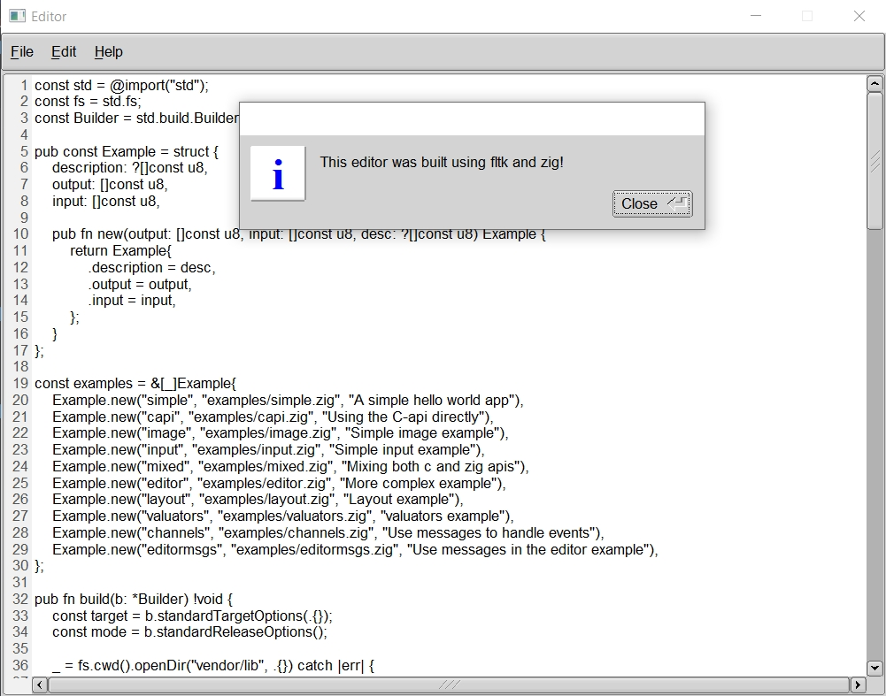

# zfltk
A Zig wrapper for the FLTK gui library.

## Running the examples
After cloning the repo, run:
```
$ zig build run-simple
$ zig build run-capi
$ zig build run-editor
$ zig build run-input
$ zig build run-image
$ zig build run-mixed
```

## Usage
Until an official Zig package manager is published, the easiest way to use the library is to add it as a subdirectory to your project, either via git submodules or git clone:
```
$ git submodule add https://github.com/moalyousef/zfltk
$ cd zfltk
$ zig build
$ cd ..
```
then you will need a build.zig file as follows:
```zig
const Builder = @import("std").build.Builder;

pub fn build(b: *Builder) void {
    const target = b.standardTargetOptions(.{});
    const mode = b.standardReleaseOptions();
    const exe = b.addExecutable("main", "src/main.zig");
    exe.addPackagePath("zfltk", "zfltk/src/zfltk.zig");
    exe.addIncludeDir("zfltk/vendor/cfltk/include");
    exe.addLibPath("zfltk/vendor/lib/lib");
    exe.linkSystemLibrary("cfltk");
    exe.linkSystemLibrary("fltk");
    exe.linkSystemLibrary("fltk_images");
    exe.linkSystemLibrary("fltk_png");
    exe.linkSystemLibrary("fltk_jpeg");
    exe.linkSystemLibrary("fltk_z");
    exe.linkSystemLibrary("c");
    if (target.isWindows()) {
        exe.linkSystemLibrary("ws2_32");
        exe.linkSystemLibrary("comctl32");
        exe.linkSystemLibrary("gdi32");
        exe.linkSystemLibrary("oleaut32");
        exe.linkSystemLibrary("ole32");
        exe.linkSystemLibrary("uuid");
        exe.linkSystemLibrary("shell32");
        exe.linkSystemLibrary("advapi32");
        exe.linkSystemLibrary("comdlg32");
        exe.linkSystemLibrary("winspool");
        exe.linkSystemLibrary("user32");
        exe.linkSystemLibrary("kernel32");
        exe.linkSystemLibrary("odbc32");
    } else if (target.isDarwin()) {
        exe.linkFramework("Carbon");
        exe.linkFramework("Cocoa");
        exe.linkFramework("ApplicationServices");
    } else {
        exe.linkSystemLibrary("pthread");
        exe.linkSystemLibrary("X11");
        exe.linkSystemLibrary("Xext");
        exe.linkSystemLibrary("Xinerama");
        exe.linkSystemLibrary("Xcursor");
        exe.linkSystemLibrary("Xrender");
        exe.linkSystemLibrary("Xfixes");
        exe.linkSystemLibrary("Xft");
        exe.linkSystemLibrary("fontconfig");
        exe.linkSystemLibrary("pango-1.0");
        exe.linkSystemLibrary("pangoxft-1.0");
        exe.linkSystemLibrary("gobject-2.0");
        exe.linkSystemLibrary("cairo");
        exe.linkSystemLibrary("pangocairo-1.0");
    }
    exe.setTarget(target);
    exe.setBuildMode(mode);
    exe.linkSystemLibrary("c");
    exe.install();

    const run_cmd = exe.run();
    run_cmd.step.dependOn(b.getInstallStep());
    if (b.args) |args| {
        run_cmd.addArgs(args);
    }

    const run_step = b.step("run", "Run the app");
    run_step.dependOn(&run_cmd.step);
}
```
Then you can run:
```
$ zig build run
```

## Dependencies 

CMake (version > 3.15), Git and a C++11 compiler need to be installed and in your PATH for a crossplatform build from source.

- Windows: No dependencies.
- MacOS: No dependencies.
- Linux: X11 and OpenGL development headers need to be installed for development. The libraries themselves are available on linux distros with a graphical user interface.

For Debian-based GUI distributions, that means running:
```
$ sudo apt-get install libx11-dev libxext-dev libxft-dev libxinerama-dev libxcursor-dev libxrender-dev libxfixes-dev libpango1.0-dev libpng-dev libgl1-mesa-dev libglu1-mesa-dev
```
For RHEL-based GUI distributions, that means running:
```
$ sudo yum groupinstall "X Software Development" && yum install pango-devel libXinerama-devel libpng-devel
```
For Arch-based GUI distributions, that means running:
```
$ sudo pacman -S libx11 libxext libxft libxinerama libxcursor libxrender libxfixes libpng pango cairo libgl mesa --needed
```
For Alpine linux:
```
$ apk add pango-dev fontconfig-dev libxinerama-dev libxfixes-dev libxcursor-dev libpng-dev mesa-gl
```

## API
Using the Zig wrapper (under development):
```zig
const zfltk = @import("zfltk");
const app = zfltk.app;
const widget = zfltk.widget;
const window = zfltk.window;
const button = zfltk.button;
const box = zfltk.box;

pub fn butCb(w: widget.WidgetPtr, data: ?*c_void) callconv(.C) void {
    var mybox = widget.Widget.fromVoidPtr(data);
    mybox.setLabel("Hello World!");
}

pub fn main() !void {
    try app.init();
    app.setScheme(.Gtk);
    var win = window.Window.new(100, 100, 400, 300, "Hello");
    var but = button.Button.new(160, 200, 80, 40, "Click");
    var mybox = box.Box.new(0, 0, 400, 200, "");
    win.asGroup().end();
    win.asWidget().show();
    but.asWidget().setCallback(butCb, mybox.toVoidPtr());
    try app.run();
}
```
The messaging api can also be used:
```zig
const zfltk = @import("zfltk");
const app = zfltk.app;
const window = zfltk.window;
const button = zfltk.button;
const box = zfltk.box;

pub const Message = enum(usize) {
    ButtonPushed = 1,
};

pub fn main() !void {
    try app.init();
    app.setScheme(.Gtk);
    var win = window.Window.new(100, 100, 400, 300, "Hello");
    var but = button.Button.new(160, 220, 80, 40, "Click Me");
    var mybox = box.Box.new(10, 10, 380, 180, "");
    win.asGroup().end();
    win.asWidget().show();
    but.asWidget().emit(Message, .ButtonPushed);
    while (app.wait()) {
        if (app.recv(Message)) |msg| switch (msg) {
            .ButtonPushed => mybox.asWidget().setLabel("Button clicked"),
        };
    }
}
```

Using the C Api directly:
```zig
const c = @cImport({
    @cInclude("cfl.h"); // Fl_run
    @cInclude("cfl_enums.h"); // Fl_Color_*
    @cInclude("cfl_button.h"); // Fl_Button
    @cInclude("cfl_box.h"); // Fl_Box
    @cInclude("cfl_window.h"); // Fl_Window
});

pub fn butCb(w: ?*c.Fl_Widget, data: ?*c_void) callconv(.C) void {
    c.Fl_Box_set_label(@ptrCast(?*c.Fl_Box, data), "Hello World!");
    c.Fl_Button_set_color(@ptrCast(?*c.Fl_Button, w), c.Fl_Color_Cyan);
}

pub fn main() void {
    c.Fl_set_scheme("gtk+");
    var win = c.Fl_Window_new(100, 100, 400, 300, "Hello");
    var but = c.Fl_Button_new(160, 220, 80, 40, "Click me!");
    var box = c.Fl_Box_new(10, 10, 380, 180, "");
    c.Fl_Window_end(win);
    c.Fl_Window_show(win);
    c.Fl_Button_set_callback(but, butCb, box);
    _ = c.Fl_run();
}
```
You can also mix and match for any missing functionalities in the Zig wrapper:
```zig
const c = @cImport({
    @cInclude("cfl.h"); // Fl_event_x() and Fl_event_y()
});
const zfltk = @import("zfltk");
const app = zfltk.app;
const widget = zfltk.widget;
const window = zfltk.window;
const button = zfltk.button;
const std = @import("std");

pub fn butCb(w: widget.WidgetPtr, data: ?*c_void) callconv(.C) void {
    std.debug.warn("{},{}\n", .{c.Fl_event_x(), c.Fl_event_y()});
}

pub fn main() !void {
    try app.init();
    var win = window.Window.new(100, 100, 400, 300, "Hello");
    var but = button.Button.new(160, 200, 80, 40, "Click");
    win.asGroup().end();
    win.asWidget().show();
    but.asWidget().setCallback(butCb, null);
    try app.run();
}
```





